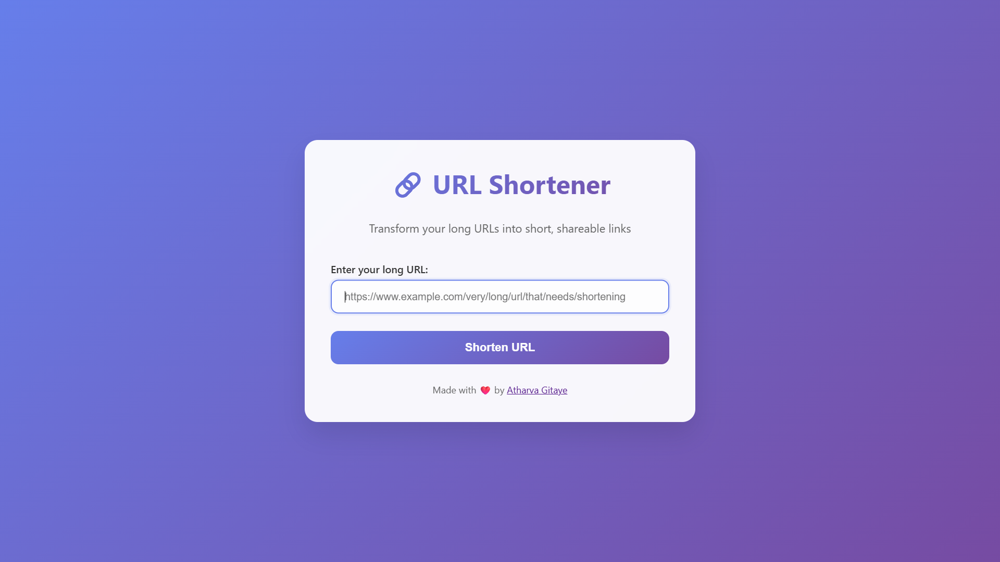
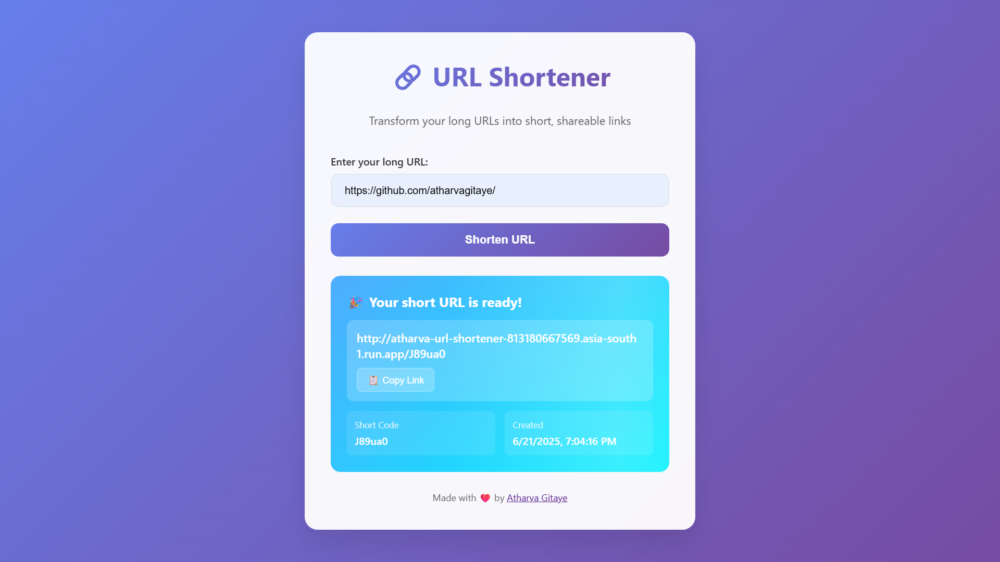

# 🔗 URL Shortener (Python + Google Cloud Functions + Firestore)

A simple and scalable URL shortener built using Python, Flask, Google Cloud Functions, and Firestore. It allows creating short URLs and automatically redirects to the original long URLs.

---

## 🚀 Features

- 🔒 Validates and shortens URLs
- 📁 Stores mappings in Firestore
- 🔁 Redirects to original URLs
- 🌍 Deployed as a Cloud Function
- 🧩 CORS-enabled for frontend integration

---

## 📸 Project Screenshot


--

## 🧠 Tech Stack

- Python 3.x
- Google Cloud Functions
- Google Cloud Firestore
- Flask (via Functions Framework)

---

## 🛠 Local Development

### 1. Clone the repository

```bash
git clone https://github.com/atharvagitaye/CDAC-Cloud-URL-Shortener.git
cd CDAC-Cloud-URL-Shortener/functions
````

### 2. Install dependencies

```bash
pip install -r requirements.txt
```

### 3. Set up Google Cloud credentials

You need a Google Cloud service account JSON file with Firestore access. Then:

```bash
export GOOGLE_APPLICATION_CREDENTIALS="path/to/your/service-account.json"
```

### 4. Start the development server

```bash
functions-framework --target=url_shortener
```

---

## 🌐 API Usage

### 🔹 POST `/` — Create a short URL

**Request:**

```http
POST / HTTP/1.1
Content-Type: application/json

{
  "long_url": "https://example.com/very/long/link"
}
```

**Response:**

```json
{
  "success": true,
  "short_code": "abc123",
  "short_url": "https://<your-host>/abc123",
  "long_url": "https://example.com/very/long/link",
  "created_at": "2024-06-21T12:34:56Z"
}
```

---

### 🔹 GET `/<short_code>` — Redirect to long URL

This will redirect the user to the original long URL.

**Example:**

```http
GET /abc123
```

---

## 📁 Project Structure

```
root/
├── functions/
│   ├── main.py              # Cloud Function entry point
│   └── requirements.txt     # Python dependencies
├── frontend/
│   └── index.html           # Basic frontend interface
└── README.md                # Project documentation

```

---

## 🛡 Security Notes

* ⚠️ Do **not** commit your service account JSON file to GitHub.
* Use environment variables or Secret Manager in production.
* Consider adding rate-limiting and logging for public use.

---

## 🚀 Deployment (Google Cloud)

Make sure you’ve enabled **Cloud Functions** and **Firestore** in your GCP project.

Then deploy with:

```
gcloud functions deploy url_shortener \
  --runtime python311 \
  --trigger-http \
  --allow-unauthenticated \
  --entry-point url_shortener \
  --project YOUR_PROJECT_ID
```

## 📜 License

MIT License. Feel free to use, modify, and share.

---

## 👤 Author

Made with ❤️ by [Atharva Gitaye](https://github.com/atharvagitaye)